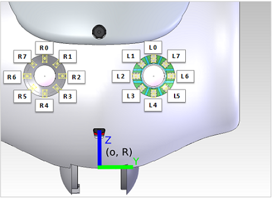
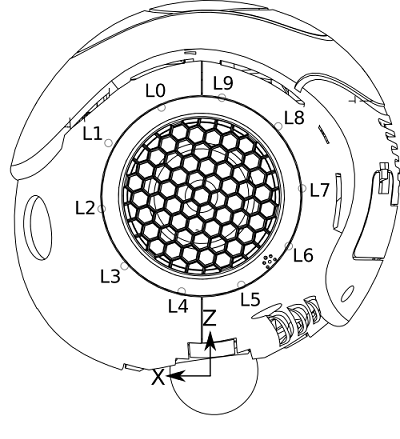
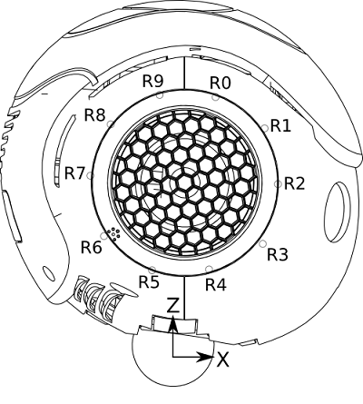

Nao Robot LED
----

###LED (%)

**Every LED is a simple actuator that has a float value from 0.0 (no light) to 1.0 (full light).**   
Each LED has only one color, but there could be 3 LEDs (RGB) at the same place to have a full color RGB LED.
But for the DCM point of view it’s always 3 LEDs. The number of real differents values of leds depends on the leds (64 for the eyes, 256 for chest & foot)

----

##Eye LED locations

####Part - Actuator Value
	R0 - Face/Led/[Color]/Right/315Deg
	R1 - Face/Led/[Color]/Right/270Deg
	……
	R6 - Face/Led/[Color]/Right/45Deg
	R7 - Face/Led/[Color]/Right/0Deg

	L0 - Face/Led/[Color]/Left/45Deg
	L1 - Face/Led/[Color]/Left/0Deg
	L2 - Face/Led/[Color]/Left/315Deg
	……
	L6 - Face/Led/[Color]/Left/135Deg
	L7 - Face/Led/[Color]/Left/90Deg

####Sensors List:
	Device/SubDeviceList/Face/Led/Red/Left/0Deg/Actuator/Value
	Device/SubDeviceList/Face/Led/Green/Left/0Deg/Actuator/Value
	Device/SubDeviceList/Face/Led/Blue/Left/0Deg/Actuator/Value
	
####编程
	
To control:

* a single LED, use Names or Short Names. 单个LED使用Name或Short Name控制；
* several LEDs, use existing Groups or create your own groups. 多个LED，使用Group Name控制；   

#####Short Name:          
* RightFaceLed1 ~ RightFaceLed8 ---- [R7 ~ R0]
* LeftFaceLed1 ~ LeftFaceLed8 ---- [L0 ~ L7]

#####Group Name: 
* FaceLed0 ~ FaceLed7  ---- [L/R0 ~ L/R7]
*  FaceLedRight0 ~ FaceLedRight7  ---- [R0 ~ R7]
*  FaceLedLeft0 ~ FaceLedLeft7 ---- [L0 ~ L7]

.
   
	FaceLedList = ["FaceLed0", "FaceLed1", "FaceLed2", "FaceLed3",
				   "FaceLed4", "FaceLed5", "FaceLed6", "FaceLed7"]
	
	
-----
##Ear LED locations

####Part - Actuator Value
	R0 - Ears/Led/Right/0Deg/Actuator/Value
	R1 - Ears/Led/Right/36Deg/Actuator/Value
	R2 - Ears/Led/Right/72Deg/Actuator/Value
	R3 - Ears/Led/Right/108Deg/Actuator/Value
	R4 - Ears/Led/Right/144Deg/Actuator/Value
	R5 - Ears/Led/Right/180Deg/Actuator/Value
	R6 - Ears/Led/Right/216Deg/Actuator/Value
	R7 - Ears/Led/Right/252Deg/Actuator/Value
	R8 - Ears/Led/Right/288Deg/Actuator/Value
	R9 - Ears/Led/Right/324Deg/Actuator/Value
####Sensors List:
	Device/SubDeviceList/Ears/Led/Right/0Deg/Actuator/Value     LED (%)
####编程

#####Short Name:          
* RightEarLed1 ~ RightEarLed10 ---- [R0 ~ R9]
* LeftEarLed1 ~ LeftEarLed10 ---- [L0 ~ L9]

#####Group Name: 

* RightEarLeds
* LeftEarLeds
* RightEarLedsBack
* RightEarLedsFront
* LeftEarLedsBack
* LeftEarLedsFront
* RightEarLedsEven
* RightEarLedsOdd
* LeftEarLedsEven
* LeftEarLedsOdd

.
	
	RightEarLedList = ["RightEarLed1", "RightEarLed2", "RightEarLed3", "RightEarLed4", "RightEarLed5", "RightEarLed6", "RightEarLed7", "RightEarLed8", "RightEarLed9", "RightEarLed10"]
	
	LeftEarLedList = ["LeftEarLed1", "LeftEarLed2", "LeftEarLed3", "LeftEarLed4", "LeftEarLed5", "LeftEarLed6", "LeftEarLed7", "LeftEarLed8", "LeftEarLed9", "LeftEarLed10"]
	
----

##Foot LED locations
####Sensors List:
	Device/SubDeviceList/LFoot/Led/Red/Actuator/Value
