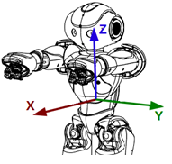

[Locomotion control - 运动控制](http://doc.aldebaran.com/2-1/naoqi/motion/control-walk.html#control-walk)
====

有三种高层次方法来控制机器人运动：

1. `ALMotionProxy::moveTo()`，控制机器人移动到目标位置。
2. `ALMotionProxy::move()`，直接控制机器人的速率、方向等，常用于循环程序中执行多次；
3. `ALMotionProxy::moveToward()`，给出归一化的速率、方向控制；参数范围：[-1,+1]，-1表示反方向最大速率，+1表示正方向最大速率；

可以修改**Move Config**参数来修改机器人默认的行走设定。    
如果要在行走时进行更多的控制，可以使用`ALMotionProxy::setFootSteps()`或`ALMotionProxy::setFootStepsWithSpeed()`，精确到走路的步数来控制机器人。    

----
  
###性能与限制：     
NAO机器人利用关节传感器的反馈信息来实现平稳走路。使得健壮的行走可以防止轻微干扰，并且可以利用前方和侧方来吸收行走时躯干的摇摆。

NAO可以在多种表面下行走，例如地毯、木制地板等。NAO可以在行走时从这些表面一步步过渡。然而如果有大型障碍物，NAO仍可能摔倒，NAO行走条件是地面或多或少是平坦些的。

##How it works

    

如图，为机器人行走时的参考坐标系；
 
###工作原理：     

* NAO的行走使用一个简单的动态模型(Linear Inverse Pendulum, 直线倒立摆), 并使用二次规划。
* 每一步都是两条腿组成，并且其中一条腿用来作为支撑，另外一条腿进行移动；
* 行走过程中，两条腿都用来支撑的状况，占用走一步所用时间的1/3。
* 脚步摆动的轨迹为SE3 Interpolation.
* Preview Controller为0.8s
* 行走是初始化后的，并且以0.6s的双脚支撑结束。

###脚步规划器(Footstep Planner)

脚步的位置由一个`ALMath::Pose2D定义(**A pose in a 2-dimentional space, [x, y, theta]**), 并且此Pose2D是相对于另一只脚的位置来表示的。相对坐标系。

