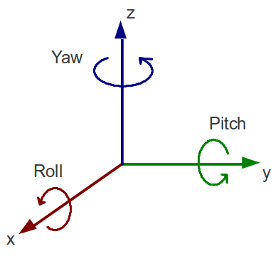

Nao Robot Motion Control
====

Naoqi Motion:   

1. ALMotion
2. ALNavigation （鸡肋）
3. ALRecharge （与NAO无关）
4. ALRobotPosture （预设姿势切换）
5. ALAutonomousMoves（管理机器人自主移动）

##[ALMotion](http://doc.aldebaran.com/2-1/naoqi/motion/almotion.html#almotion)
提供多种层次下控制机器人的方法，为控制机器人的主要模块。     
**ALMotion runs at 50Hz (cycle of 20ms). 频率50HZ**    
In ALMotion, every time you call an API to request a motion, a “**motion task**” is created to handle the job 
See Motion task to learn how to manage these task  
每次调用API执行一个动作，都会创建一个motion task；

###Control 控制
ALMotion有4组控制方法：

1. 关节开关控制 (Joint Stiffness Control, 从最根本的电机处控制开关ON-OFF)  - Stiffness control
2. 关节位置控制 - Joint control
3. 运动控制 - Locomotion control
4. 笛卡尔控制 - Cartesian control

###Reflexes 反射

ALMotion实现一些反射反应(Reflexes), 例如:

1. Self-collision avoidance              内部防碰撞
2. External-collision avoidance          外部防碰撞
3. Fall manager                          跌倒管理/保护
4. Smart Stiffness and Diagnosis effect. 关节智能调整与诊断

这些反射动作都是**默认激活**，一定条件触发下可以直接改变机器人的行为。

例如：   
机器人会改变自身动作以防止内部/外部碰撞。    
当机器人不移动时自动调整关节僵硬度以节省电量    
当检测到机器人正在跌倒时，立刻切换至跌倒保护     
当检测到设备中有潜在的错误发生时，立刻切换至特殊任务   

###性能与限制：
ALMotion为核心模块，每个周期都要不断更新，因此持续耗费CPU资源。   

当机器人执行特殊任务（例如走路），会更加耗费CPU资源。    
当机器人仅更新模型，大概占用3% CPU；走路(ALMotion核心任务)，10.8% CPU左右。    

----

###坐标系定义

机器人坐标系：对于NAO Robot，坐标系均为下图：    

 

机器人位于零姿态(the zero pose)时，其所有关节都处于初始状态。

* Roll - X轴(机器人前方) - 更改Roll，机器人左右摇晃
* Pitch - Y轴(机器人左方) - 更改pitch, 机器人前后摇晃
* Yaw - Z轴(垂直机器人向上) - 更改yaw, 机器人原地踏地转圈

ALMotion使用SI(International System of Unit, 国际单位制符号), 米、秒、弧度...

