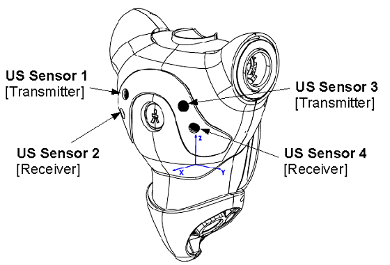
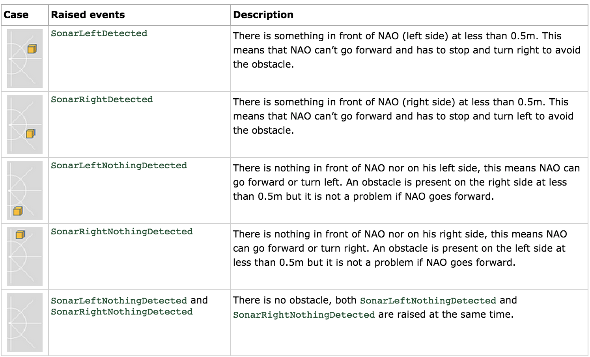

[ALSonar](http://doc.aldebaran.com/2-1/naoqi/sensors/alsonar.html#alsonar) 
----

ALsonar module retrieves ultrasonic sensor value from ALMemory, process it and raises events according to the situation.

ALSonar模块取回超声波数据，处理后根据其值触发不同事件。

###Sonar: 2 emitters, 2 receivers. 

* Frequency: 40kHz
* Resolution: 1cm-5cm (depending on distance)
* Detection range: 0.01 m - 5 m
* Effective cone: 60°

----

默认不开启超声波传感器：In order to save battery power, ultrasonic sensors are not activated by default.

###超声波事件：

* SonarLeftDetected，左侧0.5米内有障碍
* SonarRightDetected，右侧0.5米内有障碍
* SonarLeftNothingDetected，左侧安全距离内无障碍
* SonarRightNothingDetected，右侧安全距离内无障碍

---
###Performance and Limitations
1. 安全距离默认为0.5米，只有安全距离内检测到障碍物，才会触发事件。
2. Sonar Value 每100ms更新一次。从ALMemory中读取时频率要相同。
3. 同一时刻只能触发一个超声波事件(Only one sonar event is raised at the same time.)

### Getting started

#####Starting ultrasonic hardware
Ultrasonic sensor hardware is not started by default.     
默认是不开启超声波传感器的。（为了省电）    
要开启超声波，需要订阅ALSonar模块。订阅ALSonar模块后，自动开启超声波。

#####Checking the hardware
To check that your ultrasonic sensor works properly you can start Choregraphe and launch a Sonar box.     

1. First ensure that you are connected to your real NAO hardware.     
2. Then drag and drop a sonar box in your diagram and run the behavior.

#####Stopping ultrasonic hardware
取消订阅ALSonar模块，从而实现关闭超声波传感器。
只有当所有订阅者都取消订阅ALSonar模块，超声波才会关闭。

----

###超声波事件测试
code : **sonar_module.py**

1. 左右均无障碍物时，会不断触发SonarLeftNothingDetected / SonarRightNothingDetected事件。触发频率大概为2秒一次。
2. 左边有障碍物，会触发SonarRightNothingDetected事件；
3. 右边有障碍物，会触发SonarLeftNothingDetected事件；
4. 两边都有障碍物，会触发SonarLeftDetected事件，偶尔会有SonarRightDetected事件。

总体来说，这些事件有点不准确。
经过测试，直接读取传感器数值，自己设定安全距离判断，这样足够精确。
